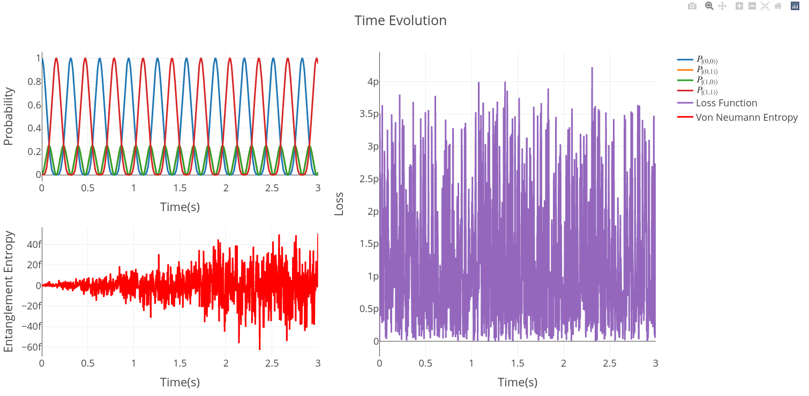

# Qunum
## Blurb
- Qunum is a physics library for general purpose simulations, symbolic quantum mechanics, physics inspired and general purpose machine learning library implemented with torch.
## Quantum Simulations:
### TQobj
- TQobj is a general purpose Torch Quantum object for numerical simulations and capable of doing backpropegation and auto-differentiation
#### Example Euler Rotation by an angle theta :
```
from qunum.numerical import TQobj
from qunum.numerical.algebra import su
import torch

sigma_matricies = TQobj(su.get_pauli(to_tensor = True), n_particles = 1)
# Declaring a new ket state randomly evaluated at 1000 points
Psi = TQobj(torch.rand((1000, 8, 1), dtype = torch.complex128), n_particles = 3)
Psi /= torch.sqrt((Psi.dag() @ Psi))

# making a density matrix
rho = Psi.to_density() # Psi @ Psi.dag()

# Operator
Rz = (sigma_matricies[3]*torch.pi/4).expm()

I = TQobj(torch.eye(2,2), dtype = rho.dtype)
Full_Operator = Rz^I^I

rho = Full_Operator @ rho @ Full_Operator.dag()

S0 = rho.Tr(0).entropy()
I01 = rho.mutual_info(0,1)
```
#### Differentiation

```
import torch
from qunum import qunum as qn 
t = torch.linspace(0, 1, 1_000)
t = t.type(torch.complex128).requires_grad_(True)

Psi = qn.TQobj(torch.zeros((1000, 2, 1), dtype = torch.complex128))

Psi[:,0,0] = torch.sin(t)
Psi[:, 1, 0] = torch.cos(t)
H = 1j * qn.Dx(Psi, t, der_dim = 0)

```

#### Time Evolution
$H = (S_{x}\otimes S_{x})B_{x}$
```
import torch as torch
from qunum import qunum as qn
from qunum.jupyter_tools.plotting import *
from itertools import product
setup_plotly()
S = qn.TQobj(qn.algebra.representations.su.get_pauli(to_tensor=True), n_particles = 1)
B = (1e1, 1.2e1)
H = (S[1]^S[1])*B[0] + (S[2]^S[2])*B[1]
t = torch.linspace(0, 3, 1000, requires_grad=True)
e1, e0 = qn.TQobj([[0],[1]], dtype = torch.complex128), qn.TQobj(torch.tensor([[1],[0]], dtype = torch.complex128))
p = (e0^e0)@ (e0^e0).dag()
Hf = qn.einsum('A, ij->Aij',t,(-1j*H))
U = Hf.expm() 
p = U.dag() @ p @ U
fig = plty_sub.make_subplots(rows=2,cols=2, specs=[[{},{'rowspan':2}],[{},{}]])
for i,j in enumerate((product(*[range(p._metadata.dims[d]) for d in p._metadata.dims]))):
    fig.add_trace(go.Scatter(y=p[:,i, i].detach().real, x = t.detach().real, name='$P_{\\left|'+str(j)+'\\right>}$'),row=1,col=1)
fig.update_xaxes(title = 'Time(s)', row=1,col=1)
fig.update_yaxes(title = 'Probability',row= 1, col=1)
fig.update_layout(title = 'Time Evolution', height = 750, width= 1500)
Loss = (1j*qn.Dx(U, t,0)-H@U)
Loss = (Loss.dag() @ Loss).real.sum(dim=(1,2))
fig.add_trace(go.Scatter(y = Loss.detach().numpy(), x = t.detach().numpy(), name = 'Loss Function'), row = 1, col=2)
S = p.Tr(0).entropy().real
fig.add_trace(go.Scatter(y = S.detach() , x = t.detach(), line=dict(color='red'), name="Von Neumann Entropy"), col=1, row=2)
fig.update_xaxes(title = 'Time(s)', row=2,col=1)
fig.update_yaxes(title = 'Entanglement Entropy',row= 2, col=1)
fig.update_xaxes(title = 'Time(s)', row=1,col=2)
fig.update_yaxes(title = 'Loss',row= 1, col=2)
iplot(fig)
```


$H = J_{x}B_{x}$
```
import torch as torch
from qunum import qunum as qn
from qunum.jupyter_tools.plotting import *
from itertools import product
setup_plotly()
S = qn.TQobj(qn.algebra.representations.su.get_pauli(to_tensor=True), n_particles = 1)
B = (1e1, 1.2e1)
H = (S[1]^S[0])*B[0] + (S[0]^S[1])*B[0]
t = torch.linspace(0, 3, 1000, requires_grad=True)
e1, e0 = qn.TQobj([[0],[1]], dtype = torch.complex128), qn.TQobj(torch.tensor([[1],[0]], dtype = torch.complex128))
p = (e0^e0)@ (e0^e0).dag()
Hf = qn.einsum('A, ij->Aij',t,(-1j*H))
U = Hf.expm() 
p = U.dag() @ p @ U
fig = plty_sub.make_subplots(rows=2,cols=2, specs=[[{},{'rowspan':2}],[{},{}]])
for i,j in enumerate((product(*[range(p._metadata.dims[d]) for d in p._metadata.dims]))):
    fig.add_trace(go.Scatter(y=p[:,i, i].detach().real, x = t.detach().real, name='$P_{\\left|'+str(j)+'\\right>}$'),row=1,col=1)
fig.update_xaxes(title = 'Time(s)', row=1,col=1)
fig.update_yaxes(title = 'Probability',row= 1, col=1)
fig.update_layout(title = 'Time Evolution', height = 750, width= 1500)
Loss = (1j*qn.Dx(U, t,0)-H@U)
Loss = (Loss.dag() @ Loss).real.sum(dim=(1,2))
fig.add_trace(go.Scatter(y = Loss.detach().numpy(), x = t.detach().numpy(), name = 'Loss Function'), row = 1, col=2)
S = p.Tr(0).entropy().real
fig.add_trace(go.Scatter(y = S.detach() , x = t.detach(), line=dict(color='red'), name="Von Neumann Entropy"), col=1, row=2)
fig.update_xaxes(title = 'Time(s)', row=2,col=1)
fig.update_yaxes(title = 'Entanglement Entropy',row= 2, col=1)
fig.update_xaxes(title = 'Time(s)', row=1,col=2)
fig.update_yaxes(title = 'Loss',row= 1, col=2)

iplot(fig)
```

